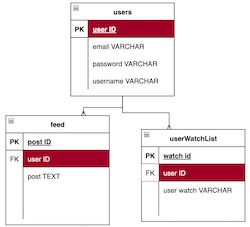
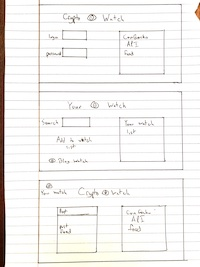

# CRYPTO WATCH 

This application is for crypto currency investors. It draws from an API from blockchain.com.
The user can log in to and have access to a social media style feed where they can post about or crypto or crypto related news. They will also be able to edit or delete these posts. 
There will be another page that will be the users personal crypto watch list where they can search a crypto from the API and add to their personal wacth list. 

As a user I would like to securely login and have a username so my email isn't on display to all the other users.

As a user I would like view and participate(post/edit/delete) in a social media style feed of crypto related content.

As a user I want to be able to view the current crypto prices on next to the feed as well as on the login page.

As a user I want curate my own crypto watch list on my own personal page that I can edit as I choose.

# INSTALATION

-fork and clone 
-run npm install 
-set up a .env with SECRET=whateversecret

# LINK

https://yourcryptowatch.herokuapp.com/

# ROUTES

-GET API feed to login page 
-GET API to post/feed page 
-POST to feed 
-PUT to edit comment 
-DELETE to delete comment 
-GET user watch list to user page 
-GET search for watch page 
-POST crypto to watch list to watch list 
-DELETE crypto from watch list 

MVP
-Add a user name to email address so email is not displayed in the public feed. 
-Have a list of current crypto currency prices from the blockchain.com API displayed on both the login page and the public feed page. 
-Have a page with a feed that users can post to with edit and delete capabilities. 
-Have a user specific page where the user can search for a crypto from the API and add it to their own watch list diplayed on this page. 
-Add a logout button as well as links from the personal watch list to the public page and vice versa. 
-Have to more models. One for the feed posts and one for the user watch list. 

STRETCH GOALS
-Add reply capability to the public feed. 
-Add a crypto investment log to the user watch list page. 
-Add a calculator to the user watch list page. 
-Make that calculator keep track of your portfolio value at the current prices. 

SPRINT GOALS
-Monday- Get the API to display current list of crypto prices on the login and feed page. Get the HTML/CSS layout for all of the pages. 
-Tuesday- get the comment feed to work and post to the database 
-Wednesday- ?  

